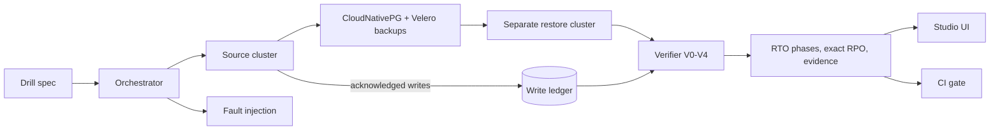

# Nostekon

**Don't assume you can recover. Prove it, every day.**

[](https://github.com/jagarkarlo/checkride/actions/workflows/ci.yml)
[](LICENSE)

Nostekon verifies recovery evidence and runs a narrow, disposable PostgreSQL
logical-restore drill across two separate k3d clusters. It measures recovery
phases and acknowledged-write loss, then checks them against explicit policy.
Whole-application recovery of GitOps state, CloudNativePG point-in-time backups,
volumes, Secrets and object storage is planned, not implemented.

> *Nostekon* (pronounced nos-TEK-on) is coined from the Greek *nóstos*
> (return, homecoming) and *tekmḗrion* (conclusive proof). A finished backup
> suggests recovery might work. A verified restore proves it.

> [!NOTE]
> **Status: pre-alpha.** Nostekon is being built as a master's thesis project
> (2026-2027). Interfaces will change without notice. The CLI, Python package,
> Go module and evidence `apiVersion` still use the name `checkride`.

## Why

Backup tools report `Completed`. That proves a backup was written, not that
your application can be restored from it.

- CloudNativePG documents an RPO of at most five minutes with WAL archiving and
  asks users to "regularly test restoring from your backups" and "measure the
  time required for a full recovery".
- EU DORA Article 12 requires periodic restore testing, restoration onto
  segregated systems, and reconciliation checks so data stays consistent
  between systems.
- Most restore tests stop at "the pods are healthy" or "the tables have rows".
  Neither proves that acknowledged writes survived.

## Verification levels

| Level | Question | Evidence |
|---|---|---|
| V0 | Did the backup report success? | Backup tool status |
| V1 | Did the restore report success? | Restore tool status |
| V2 | Is the workload healthy? | Pods ready, HTTP and TCP checks |
| V3 | Is the data structurally intact? | Tables, row counts, checksums |
| V4 | Is the data correct? | Business invariants, acknowledged-write ledger, cross-store consistency |

Every drill reports the deepest level it passed and the first level that
caught a failure.

## How it works



## Components

| Component | Purpose | State |
|---|---|---|
| Drill spec | Declarative YAML description of a drill | Validation in Python, Go API and Studio |
| Ledger | Records acknowledged writes outside the cluster and computes exact RPO | Python ledger; Go report evaluation |
| DrillRun | Bounded JSON evidence document with a published JSON Schema | Available; local API can verify detached signatures when a trusted-key directory is configured |
| Verifier | Evaluates recorded V0-V4 checks, RTO phases and RPO ledger | Available for submitted evidence; no restore execution |
| API | Go HTTP control plane, validation, schema and report endpoints | Available locally; optional server-configured Ed25519 verification |
| Report CLI | Evaluates DrillRun files and returns gate-friendly exit codes | Available as `go run ./cmd/checkride-report` |
| Attestation CLI | Signs exact DrillRun bytes and verifies detached signatures against trusted keys | Available as `go run ./cmd/checkride-attest` |
| Metrics | Pushes per-drill gauges to a Prometheus Pushgateway, with a bundled Grafana dashboard | Available via `checkride-report --pushgateway-url` |
| Lab | Disposable k3d source and restore clusters | Available; bounded PostgreSQL workload and V4 ledger checks |
| Orchestrator | Runs drills, times every phase, cleans up | Planned |
| Analyzer | Predicts restore failures before a drill from manifests and configuration | Planned |
| Studio | Drill specification workbench and evidence report UI with JSON/Markdown export | Available locally |
| Copilot | LLM that diagnoses failed drills and proposes fixes that must pass a re-run | Planned |
| Gate | CI recovery checks | Manual lab regression gate available; general freshness and deployment policy planned |

## Quick start (development)

```bash
git clone https://github.com/jagarkarlo/checkride.git
cd checkride
python3 -m venv .venv && . .venv/bin/activate
pip install -e ".[dev]"

checkride levels
checkride validate examples/drills/*.yaml
pytest
```

The Go API is in early development. From the repository root:

```bash
go test -race ./...
go run ./cmd/checkride-api
```

It listens on `:8080` by default. Set `CHECKRIDE_ADDR` to change the address;
`GET /healthz` and `GET /readyz` return `204 No Content` while the process is
healthy. Readiness will become dependency-aware as the API gains external
services.

The first Studio-facing endpoint validates a JSON drill document:

```bash
curl -sS http://localhost:8080/api/v1/drills/validate \
  -H 'Content-Type: application/json' \
  --data-binary @drill.json
```

It returns `200` with `valid`, `errors` and `warnings` for valid documents,
`422` for well-formed but invalid drills, `400` for malformed or unknown JSON,
`413` for bodies over 1 MiB, and `415` for other media types. The API currently
validates the core drill contract; it does not create or execute a drill.

Recorded evidence can be evaluated through `POST /api/v1/runs/report` or the
standalone Go command:

```bash
go run ./cmd/checkride-report examples/runs/mlflow-namespace-loss.run.json
```

The API accepts up to 16 MiB and evaluates at most four reports concurrently.
`GET /api/v1/schemas/drillrun` returns the versioned JSON Schema. The command
prints a JSON report and exits `0` for verified, `1` for failed, and `2` for
incomplete or invalid evidence. The original MLflow and CRUD example runs are synthetic; the four k3d PostgreSQL examples are locally captured lab runs. The evaluator
checks submitted claims; it does not execute restores or authenticate who
recorded the evidence. `V4` requires a write ledger or a declared invariant
with a matching check; ledger loss must also meet any declared RPO objective.

### Sign and verify evidence

An operator can create a detached Ed25519 signature over the exact DrillRun
file bytes. The public key must be distributed and trusted independently:

```bash
install -d -m 700 "$HOME/.config/checkride/signing" "$HOME/.config/checkride/trusted-keys"
go run ./cmd/checkride-attest keygen --private "$HOME/.config/checkride/signing/signing-key.pem" --public "$HOME/.config/checkride/trusted-keys/operator.pem"
go run ./cmd/checkride-attest sign --evidence /tmp/checkride-drill.json --key "$HOME/.config/checkride/signing/signing-key.pem" --output /tmp/checkride-drill.attestation.json
go run ./cmd/checkride-attest verify --evidence /tmp/checkride-drill.json --attestation /tmp/checkride-drill.attestation.json --trusted-key "$HOME/.config/checkride/trusted-keys/operator.pem"
go run ./cmd/checkride-report --attestation /tmp/checkride-drill.attestation.json --trusted-key "$HOME/.config/checkride/trusted-keys/operator.pem" /tmp/checkride-drill.json
```

Keep the private key outside the repository and distribute the public key
through a trusted channel. Key generation refuses to overwrite files, and
signing refuses private keys accessible to group or other users on Unix-like
systems. On Windows, restrict the key with filesystem ACLs. Verification
checks the evidence-byte digest, key fingerprint and signature. This proves
that the exact file was signed by the holder of the trusted key; it does not
prove that the runner was truthful, identify a person without an independently
maintained key-to-identity mapping, or establish when the signature was made.
By default, `checkride-report` marks evidence as `unverified`; with both
`--attestation` and `--trusted-key`, it verifies the signature and includes the
provenance status, key ID and evidence digest in its JSON report. Invalid
attestations fail report generation.

To verify signatures in the local API and local Studio, configure a **public-
keys-only** trust directory before starting the API:

```bash
CHECKRIDE_TRUSTED_KEYS_DIR="$HOME/.config/checkride/trusted-keys" go run ./cmd/checkride-api
```

Every `*.pem` file in that directory must be a PKIX Ed25519 public key. The API
loads at most 128 keys at startup and refuses to start if the configured
directory is empty or contains an invalid key. The Studio's **Attach
attestation** control sends the sidecar to this API; an unsigned request remains
`unverified`, and a signature from an unknown key is rejected. The static
browser demo cannot verify signatures because it has no server-side trust
store; it warns instead of claiming verification. Never put private keys in
the trusted-keys directory.

For a direct API request, base64-encode the detached sidecar into the
`X-Checkride-Attestation` header. The server verifies the signature against its
configured keys and returns the verified key ID and evidence digest in the
report. An unknown key or changed evidence is rejected; sending a signature to
an API with no configured trust store returns `503`.

```bash
sidecar=$(base64 < /tmp/checkride-drill.attestation.json | tr -d '\n')
curl -sS http://localhost:8080/api/v1/runs/report \
  -H 'Content-Type: application/json' \
  -H "X-Checkride-Attestation: $sidecar" \
  --data-binary @/tmp/checkride-drill.json
```

### Push recovery metrics to Grafana

`checkride-report` can push one gauge per drill to a Prometheus Pushgateway,
so results land in the same dashboards as the rest of your stack instead of
only a CI log:

```bash
go run ./cmd/checkride-report --pushgateway-url http://pushgateway:9091 /tmp/checkride-drill.json
```

The instance label defaults to the evidence's `metadata.name`; set
`--pushgateway-instance` explicitly in a scheduled job so every run keeps its
own series instead of overwriting the last one. A push failure is printed as
a warning and does not change the exit code. Import
[`grafana/checkride-recovery-dashboard.json`](grafana/checkride-recovery-dashboard.json)
for a ready dashboard, or read the
[full guide](site/src/content/docs/guides/metrics-and-dashboard.md).

To use the Studio locally, start the API and Studio in separate terminals:

```bash
go run ./cmd/checkride-api
cd studio && npm ci && npm run dev
```

Open `http://127.0.0.1:5173`. The development server proxies `/api` and
`/healthz` requests to the Go API on port 8080. The **Design drill** view
starts from a scenario template or imported JSON; the plan and V0-V4 depth
update as you edit. Syntax errors show their line, and selecting a validation
problem jumps to its field. `Ctrl+Enter` validates. The **Evidence report**
view imports a DrillRun, plots recovery phases and ledger outcomes, and exports
JSON or Markdown. Run Studio tests with `npm test`.

To run the disposable isolated PostgreSQL source-loss drill, install Docker,
k3d, kubectl, Python 3.12+ and Go, then use only the dedicated lab contexts:

```bash
make lab-up
python3 scripts/lab/restore.py --writes 10 --output /tmp/checkride-drill.json
go run ./cmd/checkride-report /tmp/checkride-drill.json
make lab-down
```

The runner checks that the two clusters differ, records successful PostgreSQL
writes in a private host-side SQLite ledger, dumps the data, deletes the source
namespace and restores in the other cluster. V3 checks the backed-up row count;
V4 compares recovered IDs with every acknowledgement and requires zero loss by default.
The Go report now measures RPO from this bounded workload. Add
`--after-backup-writes 2` to demonstrate two acknowledged writes lost from the
older dump; the drill and report should both exit `1`. Total writes are capped
at 100, and the default remains one backed-up write with no tail. Each evidence
file has a non-overwriting `<output>.ledger.db` sidecar.

To permit a bounded tail-loss window, set `--rpo-seconds 60` before running the
drill (whole seconds, `0` to `86400`). The budget is recorded in the evidence.
A verified run may still lose writes within that objective; holes and unexpected
IDs always fail. Studio includes three real V4 captures for zero loss, exceeded
RPO and loss within a 60-second budget. Their original bytes are retained in
`examples/runs/k3d-ledger-*.run.json`; the historical V3 sample remains unchanged.
See the [lab runbook](site/src/content/docs/guides/k3d-isolated-restore.md)
for the tested commands and exact captured measurements.

These are host-observed PostgreSQL acknowledgements, not application-specific
business validation or authenticated provenance. The runner attempts cleanup
even on failure; check for leftover `checkride-*` namespaces if cleanup reports
an error. The [lab walkthrough](site/src/content/docs/start.md) covers
prerequisites and proxy-restricted image pulls. This is not production-safe
orchestration.

The Astro product site connects the full browser Studio with MkDocs Material
documentation under `/docs/`. Install Python 3.12+, Node 22+ and Go, then build
the demo and documentation before starting the site:

```bash
python3 -m venv .venv
. .venv/bin/activate
pip install -e ".[docs]"
npm ci --prefix studio
npm ci --prefix site
npm run build --prefix site
npm run dev --prefix site
```

Open `http://127.0.0.1:4321`. Rebuild docs after Markdown changes with
`bash scripts/build-docs.sh`; `mkdocs build --strict` checks navigation and
internal Markdown links. The demo at `/demo/` evaluates reports in the browser;
the standalone Studio can also connect to the local Go API. Nostekon is
pre-alpha and only executes the narrow disposable lab drill. A paid enterprise
edition is not planned until the open-source restore workflow works reliably
end to end and operators validate a concrete need for supported deployments,
policy controls, or fleet-wide reporting.

## Related projects

Nostekon builds on these tools and is evaluated against them:

- [CloudNativePG](https://github.com/cloudnative-pg/cloudnative-pg) with the
  [Barman Cloud plugin](https://github.com/cloudnative-pg/plugin-barman-cloud)
  and [Velero](https://github.com/velero-io/velero) create the backups that
  Nostekon restores.
- [Kymaros](https://github.com/kymaroshq/kymaros) restores Velero backups into
  sandbox namespaces and checks workload health (V2).
- [Databasus](https://github.com/databasus/databasus) restores PostgreSQL
  backups into a container and reports row counts per table (V3).
- [KubeStash](https://github.com/kubestash) offers a `BackupVerifier` that
  restores and runs queries for KubeDB-managed databases.
- [AWS Backup restore testing](https://docs.aws.amazon.com/aws-backup/latest/devguide/restore-testing.html)
  schedules test restores for AWS services; Kubernetes is not covered.

## Roadmap

| Milestone | Exit criteria |
|---|---|
| M0 Pilot |  Timed namespace-loss and cluster-loss drills on k3d |
| M1 Harness | Five scenarios automated; at least 30 unattended drills per night, 90% valid |
| M2 Failure study |  Failure classes from real incidents reproduced and measured at V0-V4 |
| M3 Analyzer |  Pre-drill failure prediction evaluated against baselines |
| M4 Copilot |  Drill-verified LLM repair evaluated |
| M5 Studio and Gate |  Web UI and CI gate usable end to end |

## Contributing

See [CONTRIBUTING.md](CONTRIBUTING.md). Report vulnerabilities privately as
described in [SECURITY.md](SECURITY.md).

## License

Apache License 2.0. See [LICENSE](LICENSE) and [NOTICE](NOTICE).
