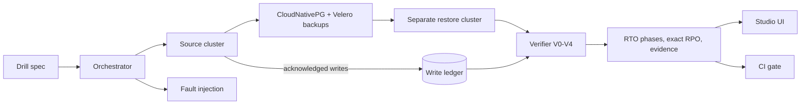

# Checkride

**Don't assume you can recover. Prove it, every day.**

[](https://github.com/jagarkarlo/checkride/actions/workflows/ci.yml)
[](LICENSE)

Checkride runs automated restore drills for Kubernetes applications backed by
PostgreSQL. It restores the whole application (GitOps state, CloudNativePG
point-in-time recovery, volumes, Secrets and object storage) into a separate
cluster, then verifies that the *right data* came back. It measures how long
every recovery phase took and exactly how much acknowledged data was lost.

> A checkride is the practical exam where a pilot has to fly the manoeuvres.
> Saying you could is not enough.

> [!NOTE]
> **Status: pre-alpha.** Checkride is being built as a master's thesis project
> (2026-2027). Interfaces will change without notice.

## Why

Backup tools report `Completed`. That proves a backup was written, not that
your application can be restored from it.

- CloudNativePG documents an RPO of at most five minutes with WAL archiving and
  asks users to "regularly test restoring from your backups" and "measure the
  time required for a full recovery".
- EU DORA Article 12 requires periodic restore testing, restoration onto
  segregated systems, and reconciliation checks so data stays consistent
  between systems.
- Most restore tests stop at "the pods are healthy" or "the tables have rows".
  Neither proves that acknowledged writes survived.

## Verification levels

| Level | Question | Evidence |
|---|---|---|
| V0 | Did the backup report success? | Backup tool status |
| V1 | Did the restore report success? | Restore tool status |
| V2 | Is the workload healthy? | Pods ready, HTTP and TCP checks |
| V3 | Is the data structurally intact? | Tables, row counts, checksums |
| V4 | Is the data correct? | Business invariants, acknowledged-write ledger, cross-store consistency |

Every drill reports the deepest level it passed and the first level that
caught a failure.

## How it works



## Components

| Component | Purpose | State |
|---|---|---|
| Drill spec | Declarative YAML description of a drill | Started |
| Ledger | Records acknowledged writes outside the cluster and computes exact RPO | Started |
| API | Go HTTP control plane; initial health and readiness endpoints | Started |
| Lab | Disposable k3d source and restore clusters | Started |
| Orchestrator | Runs drills, times every phase, cleans up | Planned |
| Verifier | Runs V0-V4 checks against the restored application | Planned |
| Analyzer | Predicts restore failures before a drill from manifests and configuration | Planned |
| Studio | Web UI: drill timeline, dependency graph, point-in-time data diff, readiness board, evidence export | Planned |
| Copilot | LLM that diagnoses failed drills and proposes fixes that must pass a re-run | Planned |
| Gate | CI check that fails when the last verified restore is too old or failed | Planned |

## Quick start (development)

```bash
git clone https://github.com/jagarkarlo/checkride.git
cd checkride
python3 -m venv .venv && . .venv/bin/activate
pip install -e ".[dev]"

checkride levels
checkride validate examples/drills/*.yaml
pytest
```

The Go API is in early development. From the repository root:

```bash
go test -race ./...
go run ./cmd/checkride-api
```

It listens on `:8080` by default. Set `CHECKRIDE_ADDR` to change the address;
`GET /healthz` and `GET /readyz` return `204 No Content` while the process is
healthy. Readiness will become dependency-aware as the API gains external
services.

## Related projects

Checkride builds on these tools and is evaluated against them:

- [CloudNativePG](https://github.com/cloudnative-pg/cloudnative-pg) with the
  [Barman Cloud plugin](https://github.com/cloudnative-pg/plugin-barman-cloud)
  and [Velero](https://github.com/velero-io/velero) create the backups that
  Checkride restores.
- [Kymaros](https://github.com/kymaroshq/kymaros) restores Velero backups into
  sandbox namespaces and checks workload health (V2).
- [Databasus](https://github.com/databasus/databasus) restores PostgreSQL
  backups into a container and reports row counts per table (V3).
- [KubeStash](https://github.com/kubestash) offers a `BackupVerifier` that
  restores and runs queries for KubeDB-managed databases.
- [AWS Backup restore testing](https://docs.aws.amazon.com/aws-backup/latest/devguide/restore-testing.html)
  schedules test restores for AWS services; Kubernetes is not covered.

## Roadmap

| Milestone | Exit criteria |
|---|---|
| M0 Pilot |  Timed namespace-loss and cluster-loss drills on k3d |
| M1 Harness | Five scenarios automated; at least 30 unattended drills per night, 90% valid |
| M2 Failure study |  Failure classes from real incidents reproduced and measured at V0-V4 |
| M3 Analyzer |  Pre-drill failure prediction evaluated against baselines |
| M4 Copilot |  Drill-verified LLM repair evaluated |
| M5 Studio and Gate |  Web UI and CI gate usable end to end |

## Contributing

See [CONTRIBUTING.md](CONTRIBUTING.md). Report vulnerabilities privately as
described in [SECURITY.md](SECURITY.md).

## License

Apache License 2.0. See [LICENSE](LICENSE) and [NOTICE](NOTICE).
